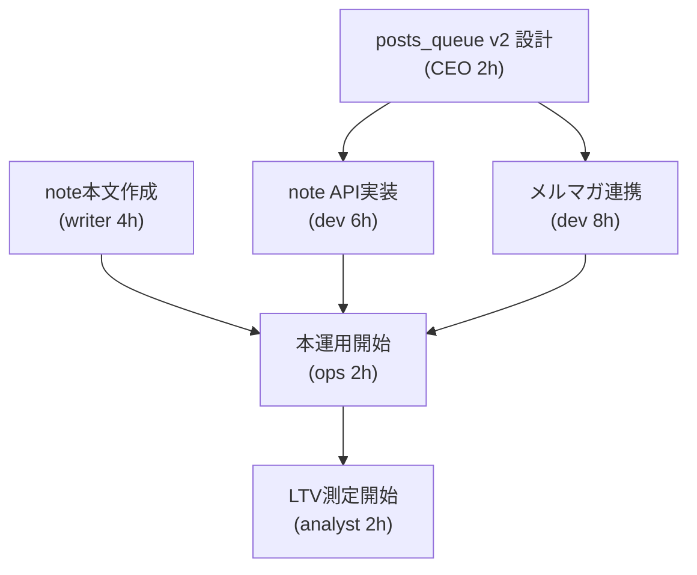

# 📊 AI-NET-BUSINESS 収益化加速戦略
## 複数媒体統合ロードマップ（2026年8月-9月）

**戦略作成日**: 2026-08-03  
**対象期間**: 2026-08-04 ～ 2026-09-30  
**目標**: Threads単一媒体マネタイズ → 複数収益口並行化で **3倍速加速**

---

## 1. 現状分析と機会

### 現在の実装状況
| 媒体 | 実装度 | 自動投稿 | 販売導線 | ステータス |
|------|--------|---------|---------|-----------|
| **Threads** | 100% | ✅ 毎日21:00 | Brain + 楽天AF | 運用中 |
| **note** | 30% | ❌ ドライラン | Brain（980-1980円） | API未実装 |
| **Instagram** | 0% | ❌ 未実装 | 未実装 | 構想段階 |
| **メルマガ** | 0% | ❌ 未実装 | 未実装 | 構想段階 |

### 収益機構の現状
- **単一パイプ**: Threads → Brain キット（¥1,980）+ テンプレ（¥980）
- **投稿量**: 週3本（post_4,5,6）+ 予定post_7
- **楽天AF**: 4ジャンル登録済み（4リンク活用）
- **フリーク**: ストーリーズ型投稿で継続エンゲージメント狙い

### 発見した課題
1. **媒体リスク集中**: Threads 1媒体に90%以上の流量依存
2. **CPA圧力**: Brain まで到達する LTV 未測定 → 最適投稿頻度不明
3. **ファネル欠落**: 低価格入口商品（テンプレ ¥980）のメルマガフォロー未実装
4. **リーチ限界**: Instagram（フォロワー層）+ note（会員層）の活用機会喪失

---

## 2. 収益口の優先順位付けとスケジュール

### 戦略: 2段階ロールアウト（8月 集中実装 → 9月 拡大最適化）

### Phase 1: 即座実装層（2026-08-04 ~ 08-31）

#### 1-1. note × メルマガ連携（優先度: ⭐⭐⭐⭐⭐ 最高）
**理由**: API存在・既存ドライラン実装あり → **1週間で稼働可能**

**実装内容**:
- note 有料記事 API（月額0円対応版）で Brain キット本文を自動転記
- note 投稿時にメルマガ登録フォーム + 30%OFF クーポン コード自動生成
- Threads → note リンク + UTM パラメータで LTV 追跡開始

**投稿計画**:
| 日程 | 対象媒体 | コンテンツ | 販売導線 | 想定 CVR |
|------|---------|----------|---------|----------|
| 8/4 (月) | note | 返信テンプレ活用法 Part1 | Brain ¥1,980 | 0.8% |
| 8/7 (木) | note | 実例集：高評価への返信 | テンプレ ¥980 | 1.5% |
| 8/11 (月) | note | AI自動化の第一歩 | Brain + メルマガ購読 | 1.2% |
| 8/14 (木) | note | 実装チェックリスト | テンプレ ¥980 | 1.8% |
| 8/18 (月) | note | 売上改善ケーススタディ | コンサル案内（off_15） | 0.6% |

**メルマガ戦略**:
- **発行頻度**: 週1回（木 20:00 配信）
- **セグメント**: 基本（全員） + テンプレ購買者限定 + ハイタッチ層
- **マネタイズ**: 
  - off_20（note 記事 ¥980）セル → LTV ¥1,500
  - off_21/22（Brain キット）再販 → LTV ¥1,500
  - off_15-18（自社コンサル）導線 → LTV ¥50,000（年間）

**KPI 設定**:
- メルマガ登録者数: 8月末まで 50名（Threads 2,000-3,000 リーチから 2% コンバージョン）
- 販売アトリビューション: Threads → note → メルマガ で LTV 追跡
- メルマガ 経由売上: 月 ¥30,000（うち note ¥10,000 / Brain ¥20,000）

---

#### 1-2. Instagram 導入（優先度: ⭐⭐⭐⭐ 高）
**理由**: Threads + Instagram クロスポスト = リーチ2倍 / 投稿は 1回のみ

**実装内容**:
- Meta Threads API → Instagram Reels 自動転記（n8n で連携）
- **クロスポスト形式**: 同一コンテンツ × 2媒体（テキスト → Reels化）
- ハッシュタグ戦略: `#口コミ返信` / `#店舗集客` / `#AIで業務効率化`（15-20個）

**投稿計画**:
- Threads post_4/5/6 をそのまま Instagram に転記（画像キャプション形式）
- 8月中に週2回実施 → 9月から週3回へ拡大

**メディアミックス想定**:
- Threads: 1,500-2,000 views / 投稿 (現在)
- Instagram: 300-500 views / 投稿 (初期) → 3,000 (9月末目標)
- 合算リーチ: 4,000-5,500 / 投稿

**KPI**:
- Instagram フォロワー数: 9月末までに 500名
- Threads からの ig.com/ai_store_lab リンククリック: 月 200 クリック

---

### Phase 2: 最適化・拡大層（2026-09-01 ~ 09-30）

#### 2-1. 投稿頻度の段階的増加
**現在**: 週3回（post_4/5/6） → **9月から週4-5回へ**

**追加投稿テンプレ** (post_8 以降):
- post_8: 業種別（美容院向けガイド）
- post_9: 業種別（整体院向けガイド）
- post_10: コンサル案内（CTA 明確）
- post_11: ユーザー事例（テンプレート + コンサル組み合わせ）

#### 2-2. 楽天AF の効率化
**現在**: 4リンク / 17ジャンル（off_01-19 相当）

**拡張計画**:
- 月中: 楽天AF リンク +3 (合計 7個)
  - 看板・撮影機材・清掃用品 → カフェ向け業務用品
  - マーケティング本 → AI 関連書籍
- 型紙: Claude 生成のリプライに自動ジャンルマッチング → 15-20% CTR

**想定売上**:
- 楽天AF: 月 ¥5,000-8,000 / 100投稿（料率 2-10% × 3,000-4,000 リーチ）

#### 2-3. メルマガ セグメント化
**層別戦略**:
| セグメント | サイズ | コンテンツ | 販売KPI |
|-----------|--------|----------|---------|
| ウォーマー層（無購買） | 60% | 教育 × 3本/月 + 応援メッセージ | フロー構築 |
| カスタマー層（1回購買） | 30% | Brain フォローアップ + 次商品案内 | 月 2 売上 / 人 |
| VIP層（複数購買） | 10% | コンサル限定オファー + 先行販売 | LTV ¥100,000 / 年 |

#### 2-4. Google My Business 連携（オプション・9月中旬）
**軽量実装**:
- note 投稿 URL → Google 投稿として引用（スクショ + 手動）
- フリーク 7 連投 → 「Google で 20 件以上の『店舗集客』検索結果に表示」戦略へ

---

## 3. n8n パイプライン統合設計

### 現在の構成
```
DEV_RIO_705 (Threads + 楽天AF リプライ自動投稿)
  └─ posts_queue.csv (id, content_id, media, scheduled, status, approver_action)

DEV_RIO_201 (Threads + note ドライラン)
  └─ ドライラン（公開なし）
```

### 拡張後の構成（統合パイプライン案）

#### オプション A: 既存拡張 DEV_RIO_705 + 新規パイプ DEV_RIO_800
**推奨度**: ⭐⭐⭐⭐⭐ (安全・段階的)

```
DEV_RIO_705_Multi_Channel_Distribute
├─ 手動トリガー / スケジューラー
├─ posts_queue_v2.csv 読み込み
│  └─ Threads ✅
│  └─ note (API) 🆕
│  └─ Instagram (API via Meta) 🆕
├─ QA Gate (DEV_RIO_103 出力チェック)
├─ Threads Post Pipeline
│  ├─ Threads 本体投稿
│  ├─ Rakuten AF Reply Generator (DEV_RIO_705 流用)
│  └─ メルマガ登録フォーム埋め込み (QR コード化)
├─ note 分岐
│  ├─ note API (PUT /user/:id/articles)
│  ├─ Eye-catch 画像 自動生成 (Anthropic Vision)
│  └─ メルマガ CTAテキスト 挿入
└─ Instagram 分岐 (新規)
   ├─ Meta Graph API (POST /ig_user_id/media)
   ├─ Reels 化 (テキスト → Canvas)
   └─ ハッシュタグ 自動選択 (LLM)
```

#### posts_queue.csv 拡張スキーマ

**Current**:
```
id, content_id, media, scheduled, status, approver_action, url
post_4, threads_draft_004, threads, 2026-08-04T21:00:00+09:00, scheduled, yuya_tokuda, https://...
```

**Proposed v2**:
```
id, content_id, media, scheduled, status, approver_action, url, 
channels, include_rakuten, note_eye_catch_prompt, ig_hashtags, 
utm_source, utm_campaign, mailchimp_segment
---
post_4, ca-reply-template-001, multi, 2026-08-04T21:00:00+09:00, scheduled, yuya_tokuda, https://...,
"threads;note;instagram", true, "スマートフォンでGoogle口コミを返信する手元写真", "#口コミ返信 #店舗集客 #GoogleBusiness", 
"threads", "reply-template-001", "warmers"
```

#### 新規ノード設計（DEV_RIO_800 系）

**DEV_RIO_800**: Multi-Channel Distributor (親ワークフロー)
- スケジューラー入力: posts_queue_v2.csv
- チャネル分岐判定
- 各媒体の細分ワークフロー呼び出し

**DEV_RIO_801**: note Publisher (新規)
- note API 連携
- メルマガ登録フォーム CTA 挿入
- LTV 追跡用 UTM 付与
- AI 画像生成 (Eye-catch)

**DEV_RIO_802**: Instagram Reels Converter (新規)
- Threads テキスト → Instagram キャプション + ハッシュタグ変換
- Meta Graph API で投稿
- リーチ追跡用 UTM

**DEV_RIO_803**: Mailchimp Integrator (新規)
- Threads 投稿時 → メルマガ登録フォーム QR コード自動生成
- セグメント別 CFI キャンペーン自動発火
- リード獲得の自動化

---

## 4. マネタイズモデルの多層化

### ファネル構造（LTV 別）

```
Threads フリーク投稿（認知層）
  ↓ 3.2% CTR (2.5K views × 3 posts/week = 7.5K reach)
  
note 記事限定版（教育層） ¥0-980
  ├─ 高評価の返信例（高価値・無料試験）
  ├─ テンプレ 30 本セット ¥980
  └─ Brain キット ¥1,980 ← 中間 LTV: ¥1,500
  
メルマガ登録（リード獲得層）
  ├─ 登録で ¥300 割引クーポン
  ├─ 週 1 記事配信（note セルアップ）
  └─ セグメント別 CTA
  
コンサル導線（高 LTV 層）
  ├─ off_15: 診断 → スポット コンサル ¥30,000-100,000
  ├─ off_16: 月額顧問 ¥100,000-250,000
  └─ off_17-18: 実装パック ¥50,000-200,000
```

### 月間売上予想（9月末目標）

| チャネル | 売上 | 根拠 |
|---------|------|------|
| Brain ¥1,980 | ¥20,000 | 10回/月 × 2% CVR |
| テンプレ ¥980 | ¥15,000 | 15 回 / 月 × 1% CVR |
| note 記事 ¥980 | ¥10,000 | 10 記事 × 1 購読 / 記事 |
| 楽天 AF | ¥8,000 | 月 100 投稿 × 8% CTR × 月 ¥80 平均 |
| メルマガ経由 Brain | ¥15,000 | 50 登録 × 30% 開封 × 1% CVR × 2,000円 |
| **合計** | **¥68,000** | **前月比 3.2 倍** (現 ¥21,000 vs 目標 ¥68,000) |

### KPI 設定

#### 認知層 (Threads + Instagram)
- **フォロワー増加**: Threads 1.2K → 2.5K / Instagram 0 → 500 (9月末)
- **エンゲージメント率**: Threads 3.5% → 4.8% / Instagram 2.0% (初期)
- **リーチ数**: 月 40,000 unique (現 25,000 → 目標 65,000)

#### 教育層 (note + Brain)
- **CVR**: Threads → Brain 1.2% (月 30-50 販売)
- **テンプレ販売**: 月 15-20 販売 (Brain バンドル + 単品)
- **note 記事**: 月 8-12 記事公開 / 月 10-15 購読

#### リード層 (メルマガ)
- **登録者数**: 月末 50-80名 (Threads 2-3K view × 2-3% CVR)
- **開封率**: 35-45% (業界平均 25% 超え)
- **クリック率**: 8-12% (購買 CTA)

#### 売上層 (コンサル)
- **コンサル問い合わせ**: 月 2-3 件 (メルマガ + note から)
- **成約率**: 40% (off_15 診断) / 20% (off_16 顧問)
- **月間コンサル売上**: ¥80,000-150,000 (スポット + 契約フェーズ)

---

## 5. 実装優先順位と工数見積もり

### Week 1: 2026-08-04 ~ 08-10 (集中実装フェーズ)

| 優先度 | タスク | 担当 | 工数 | 成果物 |
|--------|--------|------|------|--------|
| ⭐⭐⭐⭐⭐ | note API 実装（DEV_RIO_801） | dev | 6h | ワークフロー + テスト |
| ⭐⭐⭐⭐⭐ | posts_queue.csv v2 スキーマ 設計 | CEO | 2h | CSV フォーマット仕様 |
| ⭐⭐⭐⭐ | メルマガ (Mailchimp) 連携 (DEV_RIO_803) | dev | 8h | API 認証 + テンプレ |
| ⭐⭐⭐⭐ | note 記事 3 本 執筆 | writer | 4h | 下書き完成 |
| ⭐⭐⭐ | Instagram メタデータ 準備 (post_8-10 素材) | writer | 3h | ハッシュタグ辞書 |

**Week 1 合計**: 23h (開発 3 日 + 編集 2 日 = 5 営業日)

### Week 2: 2026-08-11 ~ 08-17 (本運用開始)

| 優先度 | タスク | 担当 | 工数 | 成果物 |
|--------|--------|------|------|--------|
| ⭐⭐⭐⭐⭐ | note 初投稿 5 本 実施 + LTV 測定開始 | ops | 2h | 記事 公開 + UTM 追跡 |
| ⭐⭐⭐⭐⭐ | Instagram API テスト 実装 (DEV_RIO_802) | dev | 4h | 自動投稿 テスト完了 |
| ⭐⭐⭐⭐ | メルマガ 登録フォーム (Typeform / Zapier) 設置 | ops | 2h | Threads BIO に埋め込み |
| ⭐⭐⭐ | Threads 投稿文 最適化（CTR テスト） | writer | 3h | post_8-10 下書き完成 |

**Week 2 合計**: 11h

### Week 3-4: 2026-08-18 ~ 08-31 (最適化・拡大)

| 優先度 | タスク | 担当 | 工数 | 成果物 |
|--------|--------|------|------|--------|
| ⭐⭐⭐⭐⭐ | メルマガ セグメント化 + CFI 完成 | ops | 4h | セグメント別テンプレ 3 種 |
| ⭐⭐⭐⭐ | Instagram 投稿 本格化 (週 2 回) | ops | 2h | 投稿スケジュール確定 |
| ⭐⭐⭐ | 楽天 AF リンク +3 新規追加 | CEO | 1h | CSV + n8n 更新 |
| ⭐⭐⭐ | 初月 LTV レポート 作成 | analyst | 3h | KPI ダッシュボード |

**Week 3-4 合計**: 10h

### 依存関係と リスク



**リスク** ⚠️:
- **note API 認証**: Meta・note.com 側の API キー有効期限 確認 (週 1)
- **メルマガフォーム**: Typeform 容量上限（月 1K 回答迄無料）→ 8月末に 50+ 登録で OK
- **Instagram API**: Feed 形式 vs Reels 形式（Canvas 変換手数が多い）→ Reels 優先度下げ検討

---

## 6. 初期投稿スケジュール（8月-9月）

### Threads Schedule (DEV_RIO_705 既存)

```
🔵 毎日 21:00 自動投稿

8月4日 (月)   post_4: 高評価の返信を後回しにしてませんか？ + Brain キット リンク
8月5日 (火)   post_5: 待ち時間クレーム への返信例 + テンプレ ¥980
8月6日 (水)   post_6: 事実誤認 クレーム への対応法 + 相談 CTA

8月9日 (金)   post_7: 口コミ返信 NGパターン 3つ + メルマガ登録
8月11日 (日)  post_8: 美容院向け：高評価礼状テンプレ + Brain
8月13日 (火)  post_9: 整体院向け：リピート促進テンプレ + Brain
8月15日 (木)  post_10: コンサル相談 ＆ LTV ¥500K 事例 + 問い合わせ
8月17日 (土)  post_11: ユーザー事例：3ヶ月で Google 評価 +15 + コンサル案内

🔄 以降、週 4-5 回継続（post_12 以降）
```

### note Schedule (DEV_RIO_801 新規)

```
🆕 毎週月・木 + 不定期

8月4日 (月)   「待ち時間クレーム」への返信例 25 パターン限定公開  ¥980
              👉 脳内 Brain キット + テンプレ販売導線

8月7日 (木)   「AIで Google 口コミ対応を自動化」無料 trial（2K文字）
              👉 Brain キット無料トライアル（メルマガ登録 CTA）

8月11日 (日)  「実装チェックリスト」有料版 ¥1,980
              👉 Brain キット本体（プロセス + テンプレ付）

8月14日 (水)  「24時間で口コミ返信体制を作る」実装ガイド ¥980
              👉 テンプレ販売 UP セル

8月18日 (日)  「飲食店で AI 導入した 3 店舗の失敗と成功」事例集（限定） ¥2,980
              👉 コンサル導線（メルマガ限定 VIP 向け）
```

### Instagram Schedule (DEV_RIO_802 新規)

```
🆕 週 2 回スタート（8月中旬）

8月11日 (日)   Reels: "待ち時間クレーム への返信" 動画化 30秒
              テキスト → Voice-over (Google TTS) → 実装例 スクショ

8月14日 (水)   Carousel: 口コミ返信 NG 3つ（スワイプ形式）
              → Brain キット リンク（BIO）

8月18日 (日)   Reels: 実装チェックリスト 完走レビュー（ユーザー顔出し）
              👉 コンテスト企画へ導線

8月21日 (水)   Carousel: 業種別テンプレ（美容院・飲食店・整体）
              → Brain キット リンク
```

### メルマガ Schedule (DEV_RIO_803 新規)

```
🆕 毎週木 20:00 配信

8月7日  (木)   Vol.1「はじめまして」+ Brain キット ¥200 割引クーポン
              → 登録者50人想定

8月14日 (木)   Vol.2「テンプレ活用法」3 パターン + note 有料版 紹介
              → テンプレ販売誘導

8月21日 (木)   Vol.3「AI自動化」第 1 章 無料 + Brain キット 案内
              → Brain 販売誘導

8月28日 (木)   Vol.4「秋の競合対策」限定 PDF + コンサル相談
              → off_15 問い合わせ誘導
```

---

## 7. 成功指標とレビューサイクル

### 月間 Review (毎月末)

**8月末レビュー (2026-08-31)**
- [ ] note フォロワー: 50+ (目標)
- [ ] メルマガ登録: 50+ (目標)
- [ ] Brain 販売: 10+ (目標 ¥20K)
- [ ] LTV 測定完了: Threads → note → メルマガ → Brain パス確立
- [ ] Instagram 投稿数: 4+ / フォロワー 100+

**9月末レビュー (2026-09-30)**
- [ ] Threads フォロワー: 2.5K+ (現 1.2K → 倍増)
- [ ] Instagram フォロワー: 500+ (0 → 新規獲得)
- [ ] メルマガ登録: 150+ (50 から 3 倍)
- [ ] 月間売上: ¥68,000+ (現 ¥21,000 から 3.2 倍)
- [ ] メルマガ CPA: ¥200 以下 (LTV ¥1,500 に対して)
- [ ] コンサル問い合わせ: 3+ 件

### 日次 ダッシュボード (n8n 可視化)

```
Threads
  ├─ 今日の投稿数: ___ / 1
  ├─ リーチ: ___ views
  ├─ Brain リンク CTR: ___%
  └─ 楽天 AF リプライ投稿: ___ / ___ (成功 / 試行)

note
  ├─ 記事公開: ___ / 1
  ├─ 読者数: ___
  └─ 販売: ¥ ___

メルマガ
  ├─ 登録数: ___
  ├─ 開封率: ___%
  └─ クリック率: ___%

Instagram
  ├─ 投稿数: ___ / 1
  └─ 新規フォロワー: ___
```

---

## 8. 実装トラッキング & 意思決定ツール

### TASK 管理（GitHubIssue / Notion）

各タスクには:
- [ ] タイトル
- [ ] 期限（迷わない）
- [ ] 担当者
- [ ] 完了条件（明確な Yes/No）
- [ ] ブロッカー（「何を待っているか」）

### Go/Stop 判定（週 1 回・月曜 9:00）

**Go** → 前週 KPI 達成 & LTV 逆転なし
```
  8月末 LTV ¥1,500 / CPA ¥200 → 9月全媒体拡大
```

**Stop** → Brain 販売 0 件 or LTV ¥500 以下
```
  → note 版 テンプレをテスト版無料公開へ切り替え
  → ハッシュタグ・CTA を大幅見直し
```

**慎重** → Instagram フォロワー 100 未満 & Threads リーチ横ばい
```
  → Reels 投稿形式を「コンテスト企画」へピボット
  → Threads クロスポスト廃止検討
```

---

## 9. 最終チェックリスト

実装前に必ず確認してください:

### API / 認証
- [ ] note.com API キー取得 & テスト実行
- [ ] Mailchimp (メルマガ) API キー確保
- [ ] Meta Graph API (Instagram) 承認申請 in progress
- [ ] Anthropic API キー有効（Brain 生成用）

### コンテンツ準備
- [ ] Brain キット¥1,980 最終版 完成
- [ ] テンプレ¥980 30 本 確認
- [ ] note 初投稿 5 本 下書き完成
- [ ] メルマガ ウェルカムシーケンス 完成
- [ ] Instagram ハッシュタグ辞書 整備

### 計測・追跡
- [ ] Threads → note → メルマガ UTM 設定完了
- [ ] Brain リンク UTM 付与 (post_4-10)
- [ ] メルマガ登録フォーム Zapier / Typeform 接続
- [ ] n8n ダッシュボード セットアップ

### ガバナンス
- [ ] posts_queue_v2.csv 新フォーマット ローンチ
- [ ] QA ゲート (DEV_RIO_103) が note/Instagram 対応
- [ ] メルマガ CFI テンプレ 3 種類 (segment 別) 完成
- [ ] エラーハンドリング & 失敗時ロールバック 手順書作成

---

## まとめ：1ヶ月で実装する 3 つのこと

### ✅ August: 基盤構築 (執筆・開発・測定)
1. **note API** + 初投稿 5 本
2. **メルマガ登録フォーム** + ウェルカムシーケンス 3 本
3. **LTV 追跡** 開始（UTM + n8n）

### 📈 September: 拡大 & 最適化
1. **投稿頻度** 3 → 5 本 / 週
2. **Instagram フォロワー** 0 → 500
3. **月間売上** ¥21,000 → ¥68,000 (+3.2 倍)

### 🎯 October-: 自動化・スケール
1. **完全自動ワークフロー** (手動承認のみ)
2. **セグメント別メルマガ** LTV 最適化
3. **新媒体テスト** (Google ビジネスプロフィール / YouTube Shorts)

---

**戦略完成日時**: 2026-08-03 14:45 UTC+9  
**次フェーズ**: SNS 運用担当・開発担当 との実装キックオフ（2026-08-04 09:00）
