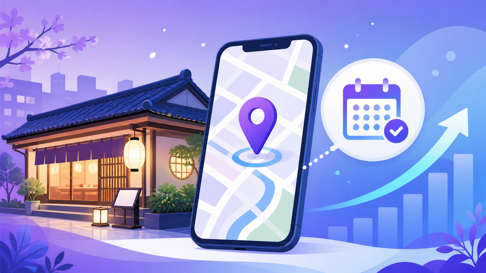
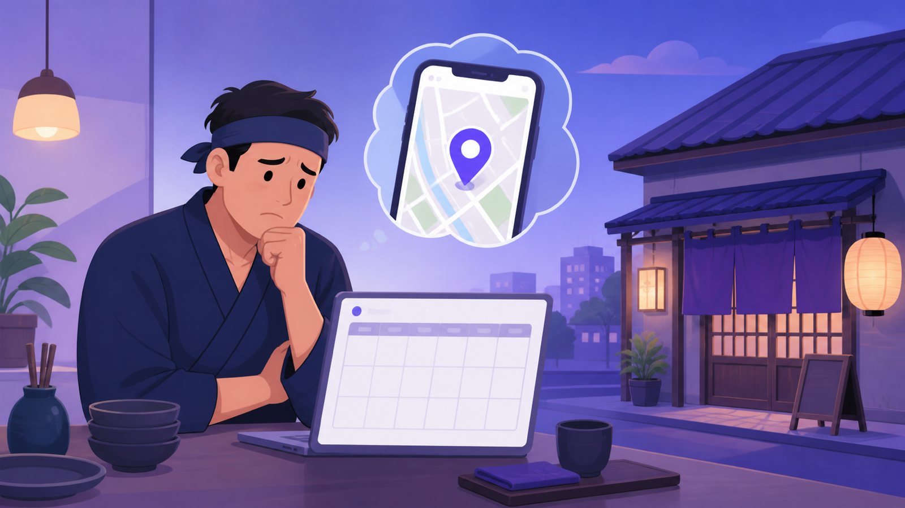
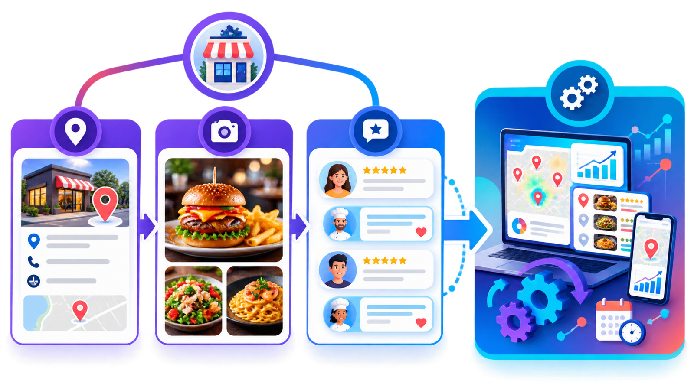
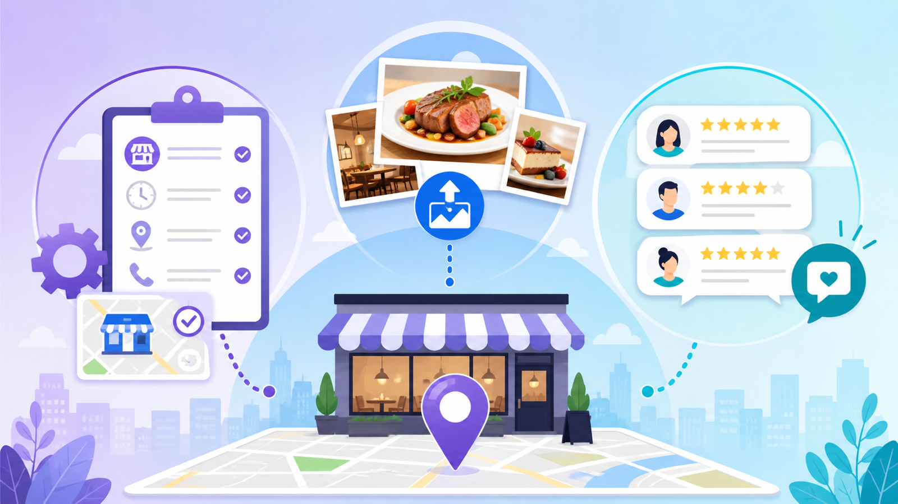
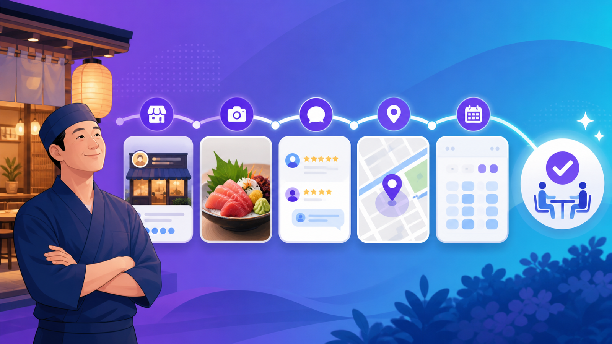

# 飲食店がGoogleマップで予約を増やす方法｜MEO対策の基本と次のステップ

※本記事にはプロモーション（アフィリエイトリンク）が含まれます

---

## このページでわかること

*Googleマップ経由の予約を増やすための実践的な手順を解説します*

- Googleマップ登録しているのに予約が来ない原因と対処法
- 無料でできるMEO対策3項目の具体的な手順
- 口コミ管理の重要性と実際に使える返信テンプレート
- AI検索（ChatGPT等）が飲食店選びに与える影響と対策
- 外部ツール（LOCALGOAT）が解決できること・向いている店と向いていない店

---

## 登録しているのに予約が来ない、あの感覚

ランチの時間が近づいてくる。厨房で仕込みをしながら、ふと予約台帳に目をやる。今日も空白が目立つ。

Googleビジネスプロフィールへの登録は、もう半年以上前に済ませた。「これでマップにも出るようになった」と安心して、その後はほぼ手をつけていない。ところが、電話予約は増えないし、ネット予約のボタンを押してくれる人も少ない。

一方で、3か月前に駅から少し離れた場所にオープンしたラーメン屋には、開店前から人が並んでいる。内装が特別豪華なわけでも、自分より年季の入った料理人が立っているわけでもない。値段も相場と大差ない。それなのに、Googleマップで検索すると向こうの方が上に出てくる。口コミも20件以上ついている。自分の店には3件しかない。

この差は、料理の腕や立地の差だけでは説明がつかない。多くの場合、**Googleビジネスプロフィールの「登録後に何を整えたか」の差**から生まれています。

登録したかどうかではなく、登録した後に継続的に更新・整備し続けているかどうか。これが、Googleマップで表示される順位と、そこから来る予約数に直接影響します。

---

## 早期結論：まず無料の整備を徹底し、限界を感じたら外部ツールへ

先に答えをお伝えします。

飲食店のGoogleマップからの予約を増やすためにまず取り組むべきことは、**お金をかけずにできる3つの整備**です。

1. Googleビジネスプロフィールの基本情報（営業時間・住所・電話番号・カテゴリ）を正確に保つ
2. 写真を月1〜2枚以上のペースで継続的に追加する
3. 口コミへの返信を1週間以内に行い続ける

この3つが整っていない段階で、月額数万円のMEO対策ツールを契約しても効果は出にくい傾向があります。土台が整っていないと、ツールが提供する付加価値を活かしきれないためです。

無料の整備を続けて「ここが限界」と感じた段階——具体的には、複数媒体の管理・口コミ対応・AI検索対策を同時に行う必要が出てきたとき——が、外部ツールを検討する適切なタイミングです。

[LOCALGOATの詳細・無料相談はこちら]

---

## 無料でできること3項目の詳細

### 1. Googleビジネスプロフィールの基本情報を正確に保つ

Googleビジネスプロフィールには、店の基本情報を入力する多くの項目があります。しかし、登録時に入力して以来、一切更新していないオーナーは少なくありません。

これが問題になるのは、情報が古くなったときです。たとえば、冬季の時短営業に変更したのにプロフィール上は通常時間のままになっていた場合、Googleマップを見てきたお客さんが閉店時間に来店するというトラブルが起きます。一度このような経験をしたお客さんが再来店する可能性は低く、否定的な口コミにつながることもあります。

確認すべき項目は以下のとおりです。

**営業時間の正確性**

定休日・祝日・年末年始・夏季休暇の変更が、都度プロフィールに反映されているか確認してください。Googleビジネスプロフィールには「特別営業時間」という機能があり、通常の定休日とは別に特定の日付だけ異なる営業時間を設定できます。これを活用することで、GWや連休中の開閉店情報をあらかじめ登録しておくことが可能です。

**住所・電話番号の一致**

移転・電話番号変更があった場合は、プロフィール上の情報も同日中に更新してください。また、住所の書き方（「○○町1-2-3」と「○○町1丁目2-3」のような表記のゆれ）も、食べログ・ぐるなびなどの他媒体と統一しておくことが重要です。Googleのアルゴリズムは複数のソースを参照して情報の信頼性を判断するため、媒体間の表記ゆれは評価に影響することがあります。

**カテゴリの設定**

カテゴリはメインカテゴリ1つと、追加カテゴリを複数設定できます。たとえばランチメインのイタリアンなら、メインカテゴリを「イタリアンレストラン」、追加カテゴリに「パスタ料理レストラン」「ランチレストラン」を加えるといった設定が考えられます。

カテゴリの選択は、どんな検索ワードで店舗が表示されやすくなるかに影響します。「近くのランチ」「パスタ 渋谷」のような検索に対して表示されやすくするためには、実際に提供しているメニューと業態を反映したカテゴリを選ぶことが基本です。

**属性の設定**

「テイクアウト可」「個室あり」「Wi-Fi完備」「バリアフリー対応」「英語対応可」などの属性情報も、設定されているかどうかを確認してください。これらの属性はGoogleマップの絞り込み検索で使われる項目であり、特定の条件でお店を探しているユーザーに発見される機会を増やします。

たとえば「個室 居酒屋 新宿」のように検索しているユーザーは、接待・記念日・女子会などの目的を持っているケースが多く、予約単価や来店動機が明確な層にリーチできる可能性があります。

**Webサイト・予約リンクの設定**

公式サイトや予約システム（ホットペッパー・一休・食べログなど）のURLを、プロフィール上のWebサイト欄・予約リンク欄に設定していますか。特に「予約リンク」は、Googleマップ上で店を見つけたユーザーが直接予約ページに飛べる動線です。これが未設定だと、電話をかけるかグルメサイトを別途検索するか、という手間がかかり、離脱率が上がる可能性があります。

---

### 2. 写真を定期的に追加する（飲食店特化の撮影・投稿ノウハウ）

Googleビジネスプロフィールに掲載されている写真の枚数と質は、ユーザーがプロフィールを見たときの「この店に行ってみたい」という感情に直接影響します。

写真が少ない・古い・暗い店と、最新の料理写真が10枚以上並んでいる店を比べたとき、ユーザーがどちらに安心感を覚えるかは明らかです。

**撮影すべき写真の種類**

| カテゴリ | 具体的な内容 | 更新頻度の目安 |
|---|---|---|
| メニュー写真 | 各料理の実際の盛り付け、季節限定メニュー | 新メニュー追加のたびに |
| 店内写真 | テーブル席・カウンター・個室の雰囲気 | 模様替え時に更新 |
| 外観写真 | 昼・夜・各季節の外観、看板、のぼり | 季節ごとに1枚程度 |
| スタッフ写真 | 調理中・接客中の自然な様子（本人同意必須） | 半年〜1年に1回 |
| イベント写真 | 季節のディナーイベント、ランチセット企画 | イベント開催のたびに |

**飲食店特有の撮影のコツ**

料理写真において最も重要なのは、「光」です。暗い店内で撮影した料理写真は、実物の色・質感を再現できず、むしろ食欲を下げる可能性があります。

*自然光を活かした窓際での撮影が、料理写真の質を大きく左右します*

スマートフォンで撮影する場合、以下の点を意識すると仕上がりが変わります。

- **自然光を使う**: 窓際で昼間の時間帯に撮影する。これが最も簡単で効果的な方法です。夕方以降の照明下では食材の色が黄みがかって見えるため、料理写真には不向きです。
- **背景を整理する**: 料理の横に醤油瓶・塩・爪楊枝入れが写っていないか確認してください。背景はシンプルな白皿・木目テーブル・布製ランチョンマットなどで整えると清潔感が出ます。
- **同じ高さで撮る**: 斜め上から45度前後の角度で撮影することで、立体感が出やすくなります。真上から撮る「真俯瞰」は映えを狙うインスタ向けですが、Googleプロフィールでは料理全体の形が見える角度の方が情報量が多く伝わります。
- **実際の盛り付けで撮る**: 撮影専用の「映え盛り」と実際の提供量・盛り付けにあまり差をつけないことが重要です。「写真と全然違う」という口コミは、信頼の毀損につながります。
- **ブレに注意する**: テーブルや台の上にスマートフォンを置いて撮影するか、両脇を固定した状態でシャッターを切ると手ブレが防げます。

**投稿のタイミング**

写真の追加は「たまに大量投稿」より「継続的に少しずつ」の方が、Googleビジネスプロフィールのアクティビティ信号として有利に働く可能性があります。月1〜2枚でも構わないので、定期的に追加し続けることを優先してください。季節の変わり目（春・夏・秋・冬）のメニュー更新タイミングは、写真を追加する絶好の機会です。

---

### 3. 口コミへの返信を続ける

*口コミへの丁寧な返信が、新規顧客の来店意欲を高めます*

口コミ管理は、飲食店のMEO対策の中で最も継続的な取り組みが必要な項目です。しかし同時に、正しく取り組めば「人が管理している店」という信頼感を新規顧客に伝えられる、非常に効果的な施策でもあります。

**なぜ口コミ返信が予約数に影響するのか**

Googleで飲食店を検索したユーザーが、店を選ぶときに何を見るかを考えてみてください。多くの場合、星の平均点と口コミの数、そして「店側が口コミに返信しているかどうか」を確認します。

特に「初めて行く店」を選ぶときの不安——「ちゃんとした店かどうか分からない」「期待外れだったらどうしよう」——を和らげるのが、丁寧な口コミ返信です。

口コミへの返信が1件もない状態と、すべての口コミに丁寧な返信がある状態を比べると、後者の方が「きちんと店を管理しているオーナーが運営している」という印象を与えやすくなります。

Googleの公式ヘルプでも、口コミへの返信がローカル検索での店舗の信頼性に影響する可能性があることが記載されています。返信の有無がアルゴリズムにどの程度影響するかは公表されていませんが、ユーザー体験の観点からも無視できない要素です。

**返信テンプレート：ポジティブな口コミへの返信（3例）**

口コミへの返信は「定型文のコピペ」が一番やってはいけないことです。同じ文章が全ての口コミ返信に並んでいると、「自動返信しているだけ」と思われ、かえって印象を下げます。

以下はテンプレートとして使いつつも、必ず**お客さんが書いてくれた内容の一部に触れる一文**を加えるようにしてください。

---

**ポジティブ返信例①：料理を褒めてもらったケース**

「○○様、あたたかいお言葉をありがとうございます。[料理名]をお気に召していただけたようで、厨房のスタッフ一同、大変うれしく思っております。旬の食材を大切にしながら、毎回丁寧に仕込んでおりますので、次にお越しの際はぜひ[季節のおすすめ]もお試しください。またのご来店を心よりお待ちしております。」

---

**ポジティブ返信例②：接客を褒めてもらったケース**

「○○様、口コミをお寄せいただきありがとうございます。スタッフの対応にお言葉をいただけたこと、大変励みになります。お客様に気持ちよく過ごしていただけるよう、日々スタッフで意識を共有しておりますので、こうして伝わったことをとても嬉しく思います。またご来店の機会があれば、ぜひ[店の特徴や次のおすすめ]もご利用いただければと思います。」

---

**ポジティブ返信例③：記念日・特別な来店だったケース**

「○○様、この度はご来店いただきありがとうございました。記念のお食事にお選びいただき、大変光栄です。特別な日に当店を思い出していただけたこと、スタッフ全員が喜んでおります。次の記念日もぜひお声がけいただければ、精一杯おもてなしさせていただきます。またお越しいただけることを楽しみにしております。」

---

**返信テンプレート：ネガティブな口コミへの返信（3例）**

ネガティブな口コミへの返信は、書き方を一つ間違えると炎上や「言い訳が多い店」という印象につながります。次の原則を守ってください。

- **反論・言い訳から始めない**：まず状況への遺憾と感謝から入る
- **具体的な改善の意思を示す**：「気をつけます」ではなく「どう変えるか」を添える
- **長文にしすぎない**：読んでもらえる限度は300字前後。自己弁護が長くなりがちなので注意

---

**ネガティブ返信例①：待ち時間・提供時間に関するクレーム**

「○○様、貴重なご意見をいただきありがとうございます。お待ちいただく時間が長くなってしまいましたこと、誠に申し訳ございませんでした。特に[ランチ/夕食]の混雑時間帯における提供スピードについて、スタッフ間での情報共有と調理の流れを見直し、改善してまいります。またのご来店の機会があれば、今後の対応でお気持ちを挽回できるよう努力してまいります。」

---

**ネガティブ返信例②：料理・味に関するご指摘**

「○○様、率直なご意見をお知らせいただきありがとうございます。[料理名]の[味・量・温度など]についてご期待に沿えなかったことを、深くお詫び申し上げます。お料理の品質は日々の重要な課題と認識しており、今回のご指摘を参考に[仕込み・盛り付け・提供温度など]の見直しを行ってまいります。ご不便をおかけして大変申し訳ございませんでした。」

---

**ネガティブ返信例③：接客態度に関するご指摘**

「○○様、ご来店いただきましたにもかかわらず、不快なご経験をさせてしまい、誠に申し訳ございませんでした。スタッフの対応についてのご指摘は、当店にとって重要なフィードバックとして受け止めております。接客の質についてはスタッフ全員で共有し、改善を図ってまいります。このたびのご意見を真摯に受け止め、お客様にとって居心地の良い店づくりに努めてまいります。」

---

**返信の期間と優先度**

口コミがついてから1週間以内に返信することを目安にしてください。古い口コミへの返信も評価されますが、直近の口コミへの返信速度が速い方が、「日常的に店を管理しているオーナー」という印象を与えやすくなります。

時間的に難しい場合は、すべての口コミに均等に対応しようとするよりも、**ネガティブな口コミへの返信を優先**してください。ネガティブな口コミへの放置は、将来の来店候補者に「この店は問題を無視するのか」という印象を与えるリスクがあります。

---

## Googleビジネスプロフィールの最適化手順（ステップバイステップ）

*スマートフォンやPCからGoogleビジネスプロフィールを管理できます*

「とにかく登録はしてある」という段階から、「整備されている状態」に近づけるための手順を説明します。

**Step 1：Googleビジネスプロフィールにオーナーとしてアクセスする**

まず `business.google.com` にアクセスし、店の登録に使ったGoogleアカウントでログインしてください。オーナー確認が完了しているアカウントであれば、ダッシュボードに自店が表示されます。

もしオーナー確認がまだ完了していない場合（「オーナー確認を行う」というボタンが表示されている場合）は、先にオーナー確認を完了させる必要があります。確認方法には、郵便でのハガキ、電話、ビデオ通話などの選択肢があり、店の状況や業種によって利用できる方法が異なります。

**Step 2：基本情報のすべての項目を一度チェックする**

ダッシュボードから「プロフィールを編集」を開き、以下の順番で全項目を確認してください。

1. ビジネス名（実際の看板・屋号と一致しているか）
2. カテゴリ（メイン1つ＋追加カテゴリ複数）
3. 住所（現在地と一致しているか、番地の表記は他媒体と統一されているか）
4. サービス提供地域（デリバリーや出張対応がある場合は設定）
5. 電話番号（現在有効な番号か）
6. 営業時間（曜日ごとの時間、定休日）
7. Webサイト（公式サイトまたは予約可能なページのURL）
8. 属性（テイクアウト可・個室あり・Wi-Fiなど）
9. 説明文（200〜750字。検索で引っかかりやすいキーワードを自然に盛り込む）

**Step 3：説明文を書く（または書き直す）**

説明文は、Googleマップ上で店を見つけたユーザーが「どんな店か」を判断する重要な文章です。ただし、説明文の内容がGoogleの検索順位に直接影響するわけではないとGoogleは明言しているため、検索順位操作目的のキーワード詰め込みは意味がありません。

あくまで「この店に来てみたい」と思ってもらうための情報を伝えることを目的に書いてください。

良い説明文の例（飲食店向け）：「2015年創業。地元の農家から直接仕入れた旬野菜をふんだんに使ったランチコースが人気の、カウンター8席・テーブル4席の小さなビストロです。平日のランチは1,800円〜、週末ディナーコースは4,500円〜。月曜定休。完全予約制での営業となりますので、お電話またはWebからのご予約をお願いしております。」

このように、食材の特徴・席数・価格帯・予約の必要性など、来店前に知りたい情報を具体的に盛り込むと、来てから「思っていたのと違う」というミスマッチを防げます。

**Step 4：写真を最低10枚以上アップロードする**

プロフィールに写真がほとんどない場合は、まず10枚以上を目安にアップロードしてください。内訳の目安は、料理写真5〜6枚・店内写真2〜3枚・外観写真1〜2枚です。

**Step 5：投稿機能を活用する**

Googleビジネスプロフィールには「投稿」機能があり、SNSのような形で最新情報・お知らせ・イベントを発信できます。この投稿はGoogleマップ上の「最新情報」タブに表示され、ユーザーがプロフィールを閲覧したときに目に触れる機会があります。

週1回程度、「今週のランチ」「今月の季節メニュー」「GW営業のお知らせ」などを投稿する習慣をつけると、プロフィールのアクティビティを維持できます。

**Step 6：インサイトを定期的に確認する**

Googleビジネスプロフィールのダッシュボードには「インサイト」という分析機能があります。「どんなキーワードで検索されたか」「写真が何回見られたか」「電話ボタンを何回タップされたか」「ルート検索が何件あったか」などのデータを確認できます。

月1回程度インサイトを見て、「電話ボタンのタップが多いのに予約が増えていない」のであれば電話対応に問題がある可能性、「プロフィールの閲覧数が少ない」のであれば写真や口コミが不足している可能性、といった形で課題を絞り込んでいくと効率的です。

---

## AI検索（ChatGPT等）が飲食店選びに与える影響と対策

2026年時点で無視できなくなっているのが、ChatGPTやGeminiなどのAI検索（AIO：AI検索最適化）への対応です。

**具体的なシナリオで考える**

あなたのお客さんになる可能性がある人が、スマートフォンを手に取り、こう質問するとします。

「渋谷で子連れでも入れるランチのおすすめを教えて」

従来のGoogle検索であれば、食べログやぐるなびのリスト記事が上位に表示され、その中からユーザーが選ぶという流れでした。しかし、AI検索ではAIが複数のソースを参照して「この3軒がおすすめです」という形で具体的な店名を挙げて回答するケースが増えています。

つまり、「AIに名前を挙げてもらえるかどうか」が集客に影響する時代になっています。

**AIがどのように情報を参照するか**

AI検索エンジンは、Webに存在するさまざまな情報源を参照して回答を生成します。飲食店の場合、主に以下の情報が参照されると考えられています。

**Googleビジネスプロフィールの充実度**

営業時間・住所・業種カテゴリ・写真・口コミ・返信——これらが揃っているプロフィールほど、AIが「信頼できる情報を持っている店」と判断しやすくなります。逆に、写真が1枚もない・口コミが0件という状態では、AIが店の特徴を把握できず、回答に含まれにくくなります。

**複数媒体での情報の一貫性（NAP一致）**

NAP（Name：店名、Address：住所、Phone：電話番号）と呼ばれる3つの情報が、食べログ・ぐるなび・ホットペッパー・自社サイト・Googleビジネスプロフィールなど複数の媒体で一致していることが重要です。

食べログには「○○町1-2-3」、Googleには「○○町一丁目2番3号」のように書かれていると、AIは「同じ店の情報かどうか」を判断しにくくなります。表記を統一するだけでも、情報の信頼性が上がる可能性があります。

**口コミの内容（具体性）**

AIは口コミの内容も参照します。「美味しかった」というシンプルな口コミより、「ランチの日替わりパスタが量が多くてコスパが良く、子連れでも個室に通してもらえて助かった」というように、具体的な利用シーン・料理名・状況が含まれた口コミの方が、AIが店の特徴を理解しやすいとされています。

口コミの内容をオーナーが操作することはできませんが、口コミを投稿してもらいやすい仕組みづくり（食後にQRコードを渡す、常連客にお願いするなど）は取り組めます。

**Webサイトの内容**

自社サイトを持っている場合、サイト内に「渋谷」「子連れ」「ランチ」「個室」といったキーワードが自然に含まれているかどうかも、AIが参照する情報の一つになります。

---

## 無料対策の限界と、外部ツールが解決できること

以上の無料対策を続けていると、ある段階で「手が回らない」「効果を測れない」という状況に直面することがあります。

**限界を感じる具体的なサイン**

- Googleビジネスプロフィール・食べログ・ぐるなび・ホットペッパーなどの情報更新に毎週30分以上かかっている
- 口コミへの返信が1週間以上できていないことが月に2回以上ある
- 「Googleマップからの流入が増えているのか、減っているのか、よく分からない」という状態が続いている
- AI検索（ChatGPT等）での表示状況を確認したいが、手動で調べる余裕がない
- 食べログ・ぐるなびなど複数媒体の営業時間更新が漏れて、誤情報が残ったままになっていた

これらのうち2つ以上が当てはまるようであれば、外部のMEO対策ツールを検討する段階に来ている可能性があります。

**外部ツールが対応できること**

MEO対策ツールが提供する主な機能は、以下のとおりです。

- 複数のグルメ媒体・Googleビジネスプロフィールの情報を一括管理・更新
- 口コミの一括管理・返信サポート（AI生成の返信文の提案など）
- Googleマップでの検索順位のモニタリング・レポート
- AIO（AI検索最適化）への対応
- SNSとの連携・投稿管理

[LOCALGOATの詳細・無料相談はこちら]

---

## LOCALGOATの機能詳細と飲食店での活用シーン

LOCALGOATは、飲食店・小売店などの実店舗向けに、MEO対策・口コミ管理・AIO対策を一括で提供するサービスです。A8.netを通じたアフィリエイトパートナーによって紹介されているサービスで、公式サイトでの詳細確認・無料相談が可能です。

**主な機能（公式サイト情報を基に記載）**

LOCALGOATが提供する機能の概要は以下のとおりです。ただし、詳細な仕様・料金・提供内容は公式サイトで必ず最新情報を確認してください。

**Googleビジネスプロフィールの最適化サポート**

プロフィールの現状を分析し、改善すべき項目を整理するサポートが受けられます。自分だけでは気づきにくい設定漏れや、カテゴリの最適化についてアドバイスを受けることが可能です。

**口コミ管理・返信サポート**

複数の口コミを一画面で管理し、AI機能を使った返信文の作成サポートが利用できます。毎週口コミを確認して返信する作業が、ツールによって効率化できる可能性があります。

**AIO（AI検索最適化）への対応**

ChatGPT・Geminiなどのai検索で飲食店が表示されやすくなるための対策について、専門的なアドバイスが得られます。自店がAI検索でどのように認識されているかを把握するためのサポートを受けられます。

**複数媒体の一括管理**

食べログ・ぐるなびなど複数のグルメ媒体とGoogleビジネスプロフィールの情報を、一元的に管理できる機能があります。複数媒体の情報更新に時間がかかっている店舗にとっては、作業の効率化が期待できます。

**飲食店での活用シーン**

- ランチ時間帯の集客を強化したいカフェ・定食屋が、Googleマップでの「近くのランチ」検索での表示を改善したい場合
- 口コミへの返信に時間を取れていなかった忙しい一人オーナーが、口コミ管理を効率化したい場合
- 複数店舗を運営する飲食グループが、各店の情報を一括管理したい場合
- AI検索での表示状況を改善し、新規客の流入を増やしたいと考えている場合

---

## デメリット・注意点（ツール導入を検討する際に知っておくこと）

外部ツールを検討する際に、事前に把握しておくべき点を正直にお伝えします。

**1. 基本整備が済んでいないと効果が薄い**

繰り返しになりますが、Googleビジネスプロフィールの基本情報が不正確・写真が少ない・口コミ返信が一切ないという状態で外部ツールを導入しても、土台がない状態にオプションを積み重ねることになります。まず無料でできる基本整備を先に行ってください。

**2. 料金・最低契約期間は必ず確認する**

MEO対策ツールの月額費用は、サービスの内容・規模・契約形態によって大きく異なります。月額数万円から、導入費用が別途かかるものまで様々です。特に以下の点は契約前に必ず確認してください。

- 最低契約期間（3か月・6か月・1年など）
- 中途解約時の違約金の有無と金額
- 価格改定の方針（導入後に料金が変わる可能性）
- 無料トライアル・無料相談の有無と内容

「思ったより使わなかったが、解約できない期間が残っている」という状況を避けるために、無料相談の段階で契約条件を明確にしておくことをおすすめします。

**3. ツールが代わりにコンテンツを作るわけではない**

口コミ返信のAI文案生成・SNS投稿のサポート機能があるサービスもありますが、「どんな料理を提供するか」「どんな雰囲気の店かを表現するか」「どんな客層に来てほしいか」という店の核心部分は、あくまでオーナー自身が判断・決定する必要があります。ツールは「手間を省く」ものであり、「店のブランドを作る」のはオーナー自身です。

**4. 効果が出るまでに時間がかかる**

MEO対策は、始めてすぐに予約数が劇的に変化するものではありません。Googleのアルゴリズムが更新された情報を反映するまでに数週間かかることもあります。「1か月で結果が出なかったからダメだ」と判断せず、3〜6か月を一区切りの目安にすることが現実的です。

**5. ツールの効果を数字で把握する仕組みを作る**

外部ツールを導入したら、「導入前後でどの数字が変わったか」を確認できる状態にしておいてください。Googleビジネスプロフィールのインサイト（閲覧数・ルート検索数・電話ボタンタップ数）、および実際の予約数・来店数の変化を記録しておくことで、効果の有無を判断できます。

---

## 向いている店・まだ早い店の正直な線引き

すべての飲食店に外部MEO対策ツールが必要というわけではありません。以下を参考に判断してください。

**LOCALGOATを含む外部ツールが向いている店**

- 複数のグルメ媒体に出店しており、情報更新の管理が追いつかなくなっている
- Googleマップからの流入は一定数あるが、予約への転換率が低いと感じている
- AI検索への対応を個人で行うのが難しいと感じている
- 月次でMEOの効果を数字で確認しながら改善していきたい
- 複数店舗を運営しており、各店のGoogleビジネスプロフィール管理に多くの時間がかかっている

**まだ早い（無料整備を先に行うべき）店**

- Googleビジネスプロフィールの基本情報に未更新・誤りがある
- 写真が5枚以下、または直近1年で新しい写真を追加していない
- 口コミへの返信が一切できていない
- 開業して間もなく、SNS・ポータルサイトへの掲載自体がまだ少ない
- 現時点で月の集客がほぼゼロで、Googleマップ以前の基本的な認知活動が必要な段階

---

## FAQ（よくある質問）10問

**Q1. Googleビジネスプロフィールに登録していれば、Googleマップに自動で上位表示されますか？**

A. 登録だけでは上位表示には不十分です。Googleマップのローカル検索結果での表示順位は、主に「関連性（検索ワードとの一致度）」「距離（ユーザーの現在地との距離）」「知名度（口コミの数・評価・Web上での言及など）」の3つの要素によって決まるとGoogleは公式に説明しています。これらを改善するための継続的な取り組みが、表示順位の向上につながります。登録しただけで何もしない状態では、競合が整備を進めるにつれて相対的に表示が下がっていく可能性があります。

**Q2. 口コミの星の数を上げるには何が最も効果的ですか？**

A. 根本的には「サービスの質を上げる」ことが前提ですが、口コミの数を増やす実践的な方法として最も効果があるとされているのは、「来店直後のお客さんに口コミをお願いする」ことです。食後の会計時に「Googleに口コミを書いていただけると大変励みになります」と一言添えるか、テーブルにQRコードを置いて口コミページに誘導する方法があります。満足度が高い瞬間にお願いすることが、ポジティブな口コミにつながりやすいタイミングです。ただし、特典や報酬と引き換えに口コミを依頼することはGoogleのポリシーに違反するため、絶対に行ってはいけません。

**Q3. ネガティブな口コミを削除することはできますか？**

A. 基本的にはできません。ただし、Googleのポリシーに違反する口コミ（スパム、事実無根の中傷、個人情報を含む内容など）については、Googleに削除申請を行うことが可能です。申請してもGoogleが削除を判断するまでに時間がかかることがあり、必ずしも削除されるわけではありません。最も現実的な対応は、誠実な返信によってネガティブな印象を和らげることです。読んでいる第三者（将来の来店候補者）は、ネガティブな口コミの内容だけでなく、店側の返信の仕方も見ています。

**Q4. MEO対策に取り組んでから、効果が出るまでどれくらいかかりますか？**

A. 明確な期間は断定できませんが、取り組みの内容と競合の状況によっても変わります。写真の追加・基本情報の更新などは比較的早くGoogleに反映されることがありますが、検索順位に影響が出るまでは数週間〜数か月かかるケースが多いとされています。口コミの増加は口コミが実際に集まるペースに依存するため、これも即効性はありません。外部ツールを使う場合も含め、3〜6か月を一つの目安として継続して取り組む姿勢が必要です。

**Q5. 食べログ・ぐるなびなどのポータルサイトとGoogleビジネスプロフィール、どちらを優先すべきですか？**

A. どちらか一方を選ぶというより、役割が異なるため両方を整備することが基本です。食べログ・ぐるなびは「グルメ情報を探しているユーザー」に対して一覧の中から選ばれる場所であり、レビューの信頼性や掲載情報の詳細さが重要です。Googleビジネスプロフィールは「Googleマップで現在地周辺の店を探しているユーザー」に対して機能し、地図上での表示と口コミが重要です。リソースが限られている場合は、現在の来客のうちどのルートで来ている人が多いかを確認し、そのチャネルを優先して整備するのが合理的です。

**Q6. Googleビジネスプロフィールへの投稿機能は本当に効果がありますか？**

A. 投稿機能が検索順位に直接影響するかどうかは、Googleも公式には明言していません。ただし、プロフィールを定期的に更新している店舗の方が「アクティブな店舗」とGoogleが判断しやすくなるという見方はあります。また、ユーザーがプロフィールを閲覧した際に「最新情報」タブに投稿が表示されることで、来店の背中を押す効果が期待できます。週1回程度の更新であれば大きな作業負担ではないため、継続できる範囲で取り組む価値はあります。

**Q7. スマートフォンで撮った料理写真でも問題ありませんか？プロに依頼した方がいいですか？**

A. 現在のスマートフォンカメラは十分な解像度があり、「光」と「背景」さえ整えれば、プロ機材なしでも見栄えの良い料理写真を撮ることは可能です。自然光が入る窓際・白い背景・料理が実際の提供形態に近い状態——この3点を守るだけで、暗い場所で雑然とした背景で撮った写真との差は大きくなります。予算がある場合はプロのフードフォトグラファーに依頼することで、より魅力的な写真が得られますが、月数枚の継続的な更新まで全てプロに依頼するのはコスト面で現実的ではないケースが多いです。日常の写真はスマートフォンで、特別なメニューや店の顔となるメイン写真はプロに依頼する、という使い分けも一つの方法です。

**Q8. Googleビジネスプロフィールを別の人（スタッフ）に管理させることはできますか？**

A. はい。Googleビジネスプロフィールでは、複数のユーザーに管理権限を付与できます。権限には「オーナー」「管理者」「サイト管理者」の3種類があります。スタッフに管理を委ねる場合は「管理者」権限を付与する方法がありますが、管理者は多くの操作が可能なため、信頼できる人物に限定してください。また、退職・離職の際には速やかに権限を削除してください。操作ミスによる情報の誤変更や、離職したスタッフが引き続き管理権限を持ったまま残るリスクに注意が必要です。

**Q9. 複数店舗を運営していますが、各店をGoogleビジネスプロフィールで別々に管理する必要がありますか？**

A. はい。店舗ごとに別々のGoogleビジネスプロフィールを作成・管理する必要があります。それぞれの住所・電話番号・営業時間が異なるため、1つのプロフィールで複数店舗をまとめることはできません。ただし、同じGoogleアカウントで複数のプロフィールを管理することは可能です。また、3店舗以上を運営している場合は「ビジネスグループ」機能や、Googleが提供するビジネス向けの一括管理ツールの活用を検討することで、管理の効率が上がる可能性があります。複数店舗の管理に時間がかかっている場合は、外部MEO対策ツールの一括管理機能を使う選択肢が有効になるケースが多いです。

**Q10. MEO対策をしないままだと、今後どんなリスクがありますか？**

A. 最も現実的なリスクは、「整備している競合店との差が開き続ける」ことです。あなたの店が何もしない間に、近隣の競合が口コミを増やし・写真を充実させ・AI検索への対策を進めれば、GoogleマップやAI検索でのリーチは相対的に下がっていきます。また、2026年時点ではAI検索が飲食店選びに影響し始めているため、今後「Googleマップで検索する」だけでなく「AIに聞く」という行動が増えていくにつれて、整備していない店は新規顧客の選択肢から外れるリスクが高まります。コストをかけずにできる基本整備を後回しにする理由はなく、「今日始める」ことのコストは実質ゼロです。

---

## まとめ：今日から始める最初の1ステップ

*MEO・AIO・口コミ管理を一括で効率化。LOCALGOATの詳細・無料相談はこちら*

Googleマップからの予約を増やすためにすることは、複雑ではありません。ただ、続けることが難しい。

今日できる最初の1ステップは一つだけです。

**`business.google.com` にログインして、営業時間・住所・電話番号・カテゴリが現在の状態と一致しているかを確認する。**

もし一か所でも間違いがあれば、それを直す。写真が3枚以下であれば、今日中に1枚でも追加する。口コミが1件でも未返信のままになっていれば、まずそれに返信する。

この積み重ねが、「登録しているのに予約が来ない」という状態を少しずつ変えていきます。

整備が進んで「一人で全部回すのが限界」と感じたとき、複数媒体の一括管理・AIO対策・口コミ管理を効率化するために外部ツールを検討してください。

[LOCALGOATの詳細・無料相談はこちら]

---

*本記事の情報は2026年8月時点のものです。Googleビジネスプロフィールの仕様・機能は変更されることがあります。最新情報は公式サイト（business.google.com）でご確認ください。LOCALGOATの料金・機能・サービス内容については、公式サイトまたは無料相談にてご確認ください。*
